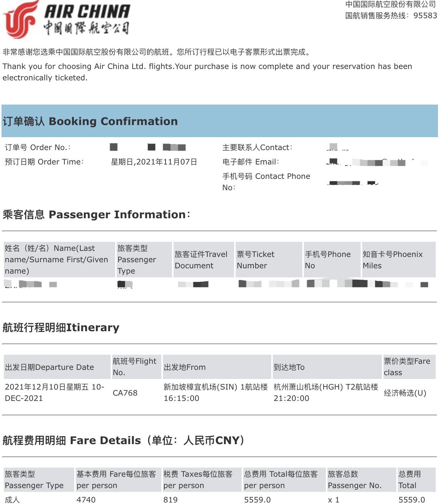

<!-- vscode-markdown-toc -->
* [1. 机票预订](#.)
* [2. 核酸检测预约](#.-2)
* [3. 疫苗接种凭证](#.-3)
* [4. 行前十四天闭环+行前七天测体温](#.-4)
* [5. 核酸检测](#.-5)
	* [5.1 核酸检测报告](#5.1)
* [6. 健康码申请](#.-6)
* [7. 值机](#.-7)
* [8. 其他](#.-8)

<!-- vscode-markdown-toc-config
	numbering=true
	autoSave=true
	/vscode-markdown-toc-config -->
<!-- /vscode-markdown-toc -->

##  1. 机票预订
1. 尽量在出行前至少一个月购买，比较便宜。
2. 预订好机票之后会收到：出票确认邮件（即行程单，需包含乘客信息及航班信息，建议打印1-2份，做核酸检测时用。样例见下图）

##  2. 核酸检测预约
1. 需预约中国驻新加坡大使馆认可的[核酸检测机构](https://www.moh.gov.sg/docs/librariesprovider5/covid19_test_providers/approved-covid-19-pcr-swab-provider-(08-jan-2021).pdf) (已经预约了的可以检查一下比较放心，但是基本上坡岛上大部分诊所都在这个名单里面噢:))。
2. 预约时间：行前第一次核酸检测必须在行前<b>第3天</b>进行，行前双检测必须在行前<b>第2天</b>进行，其他时间点均为无效检测。如因医疗机构原因造成未按时检测，应由医疗机构出具有关情况说明。健康码有效期为第一次核酸检测日期+3天确定。（例如4号的航班，应在1号进行第一次核酸检测，并在2号进行双检测，其他时间检测无效。健康码系统检测日期填写2号，健康码有效期截至4号23时59分。）（摘自大使馆官网）
3. 行前3日的核酸检测与行前2日双检测必须遵循“交叉检测”原则。“交叉检测”指的是<b>采样和检测均需选择不同机构</b>，且其中一家须为莱佛士医疗集团或Parkway（百汇）医疗集团合作诊所。在同一家诊所采样分送不同检测机构检测或在同一家检测机构进行两次检测均无效。（摘自大使馆官网）

注意事项：
1. 有些诊所<b>不具备独立检测核酸的实验室</b>，它们只负责采样并将样品送到莱佛士医疗集团或Parkway（百汇）医疗集团进行检测。最好在预约时以及核酸检测前的医生咨询时确认一下两所机构是否符合“交叉检测”原则。
2. 建议定下机票之后<b>尽早</b>预约核酸检测。（本人提早半个月预约，但附近的诊所几乎都预约满了）
3. 部分诊所可以不需要预约直接walk in，但是为了保险起见，建议预约。
4. 如果预约电话一直没接，不妨试试发邮件！
5. 如果其中一次想预约在莱佛士医疗集团做核酸检测，可下载Raffles Connect App操作。
6. 不同诊所价格差别很大。（见下图。仅供参考：大部分核酸检测130新左右，核酸与N蛋白抗体双检测200新左右。）

   

##  3. 疫苗接种凭证
1. 拥有SingPass账号。（建议带上准证直接去附近的CC办理，不用预约，大概10分钟左右完成。）
2. 登陆 https://www.notarise.gov.sg/ 网站，选择疫苗接种证书（见下图）并按流程办理。

3. 办理完成之后Singpass App会收到如下信息，保存疫苗接种的证书即可。

注意事项：
1. 上述方法下载的疫苗接种证明是带二维码的，样例如下。
2. 对于无法通过二维码验证的疫苗接种凭证，旅客需同时上传接种证明和《新冠疫苗接种声明书》（中国公民签名须手写正楷汉字全名）。（可以去[大使馆](http://www.chinaembassy.org.sg/lsfw/26511/202110/t20211030_10403937.htm)（附件3）下载声明书）

##  4. 行前十四天闭环+行前七天测体温
1. 旅客应严肃对待《[健康防护监测和承诺书](健康防护监测和承诺书.docx)》，按照要求行前14天闭环管理及体温记录，并如实填写有关申报事项。使馆将电话抽查核实有关情况，对于不了解《承诺书》内容、不实申报或不能合理解释的疑点，将锁定申请并进一步排查。（摘自大使馆官网）
2. 前七天的温度记录指<b>申请健康码的前七天</b>温度记录。
2. 闭环期间只有外出检测是必要的。大使馆可能会<b>打电话</b>抽查。

##  5. 核酸检测
1. 携带行程单（见1.机票预订，softcopy也可以），护照，准证。
2. 再次强调：有些诊所<b>不具备独立检测核酸的实验室</b>，它们只负责采样并将样品送到莱佛士医疗集团或Parkway（百汇）医疗集团进行检测。最好在预约时以及核酸检测前的医生咨询时确认一下两所机构是否符合“交叉检测”原则。
3. 一定要告知医生：a) 飞往中国；b) 接种疫苗的类型(科兴/辉瑞/...); c) 强调所有信息都要填写完整，例如姓名全称（可能会改成简写只留首字母），NRIC/FIN Number要填写完整。（经验：医生在采样前会跟你再次确认信息准确性，这时候一定要认真检查，可以拍照以防万一）。
4. 可以提早去诊所检测，诊所只看预约与否，不看具体预约时间。直接walk in的话队伍可能会很长。（见下图）

###  5.1. 核酸检测报告
1. 快的话当天晚上，慢的话第二天会出核酸检测报告。会先收到短信通知阴性/阳性结果，报告会在之后发放，不用着急哦:)（24小时内会出结果的，大家不用着急。莱佛士医疗集团的报告可能会出的比较早）
2. 带有<b>可验证二维码</b>的检测证明。（建议打印一份，值机时用，样例如下）可以自己扫描二维码检查一下。

##  6. 健康码申请
1. 需要准备的材料：a）行程单（见1.机票预订）；b）疫苗接种证明（见3.疫苗接种凭证，如果接种证明不含可验证二维码，旅客需同时上传接种证明和《新冠疫苗接种声明书》）；c）健康防护监测和承诺书（见4.行前十四天闭环+行前七天测体温）； d）准证 正反面照片（或白卡）；e）核酸检测前两天以及前三天的阴性证明（见5.1 核酸检测报告）。可登陆《[赴华健康码指南系统](https://wj.qq.com/s2/6485696/5778/)》（网址：https://wj.qq.com/s2/6485696/5778/ ），按个人情况勾选后即可显示申请健康码所需材料。
2. 微信小程序：防疫健康码国际版！也可网页登陆：https://hrhk.cs.mfa.gov.cn/H5/login。
3. 填写资料过程中可能存在的问题：
    1. 中国国籍选择有居民身份证者。
    2. 选择核酸和血清抗体检测机构时<b>均选择行前两天检测的机构</b>。
    3. 采样日期选择<b>行前两天</b>检测的采样日期。
    4. 建议上传jpg/jpeg格式图片，可手机截图，多张上传。（如想要合并多张图片为一张长图，可用StitchPics App，免费）
4. 行前会收到航空公司要求填写《旅客告知书与个人承诺书》的短信（见下图），可以选择填写票号或者护照号码。其中票号即行程单中“票号Ticket Number”，大多是以999开头的号码序列。填完过后请保存回执图片值机时用（样例见下图）。

##  7. 值机
1. 需要准备的材料：a）护照；b）准证/白卡；c）行前2天和行前3天带有<b>可验证二维码</b>的检测证明（见5.1 核酸检测报告，如果没有打印，softcopy也可以）。（建议：尽量把这些材料存放在容易拿取的地方，并准备一支笔）
2. 到达机场之后，会要求扫描下图的二维码填写《旅客告知书与个人承诺书》。其内容跟 六.4 一致，只需给机场工作人员出示保存的回执图片即可。

3. 向机场工作人员出示回执之后，工作人员会给你一张表格（见下图），填写黄色高亮部分。

4. 排队......
5. 排至下图所示处，需要将你所准备的材料（见7.1）及调查表（见7.3）交给工作人员并出示健康码。

6. 快乐值机：给工作人员出示健康码，护照，准证。
7. 值机完成之后需要填写两个海关码（见下图），此处需要填写去国内的具体目的地。填完后保存图片，入境中国时用。

##  8. 其他
1. 强烈建议携带的物品: a)能够在国内使用的充电器；b）浴室用拖鞋；c）纸巾；d）牙刷牙膏。
2. 国内没有大家想象中的冷，下飞机之后一件短袖，一件薄长袖，加上防护服就足以。
3. 飞机落地之后可能需要一两个小时过海关，乘客才能够下机。需要耐心等待哦:)

## 最后，欢迎回家:)
